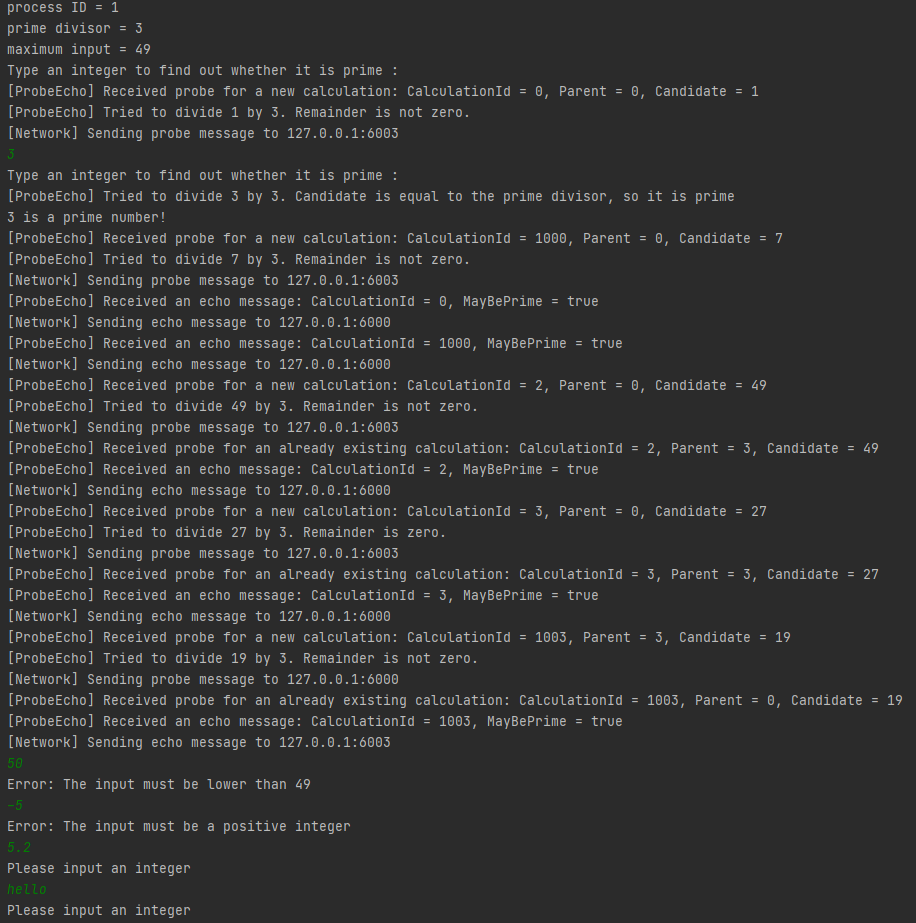
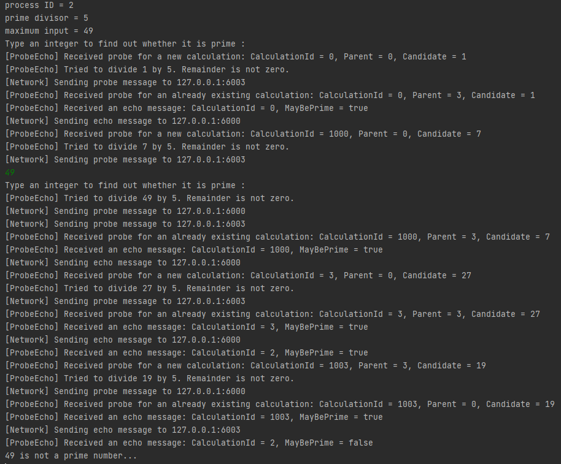

# PRR_Labo4

# Starting the application
The binary to run the application is available in the latest release on the repo, at https://github.com/G-Houlmann/PRR_Labo4/releases/tag/v1.0 . Download the binary you need for your OS, as well as the config.json file. Specify a configuration in the config.json file and put it in the same folder as the binary. Do so on every machine specified in your configuration. The config.json file MUST be exactly the same on every machine. You can now run the binary on all the machines of your config. Don't forget to specify the id of the process as the first and only argument. Example : `./PRR_labo4 1` on linux or `./PRR_labo4.exe 1` on Windows.
The application will start being usable once every machine specified in the config has the application up and running.

Note: You can build your own binary with go build in the root directory of the repo.

## Configuration instructions  
When filling in the configuration file, please pay attention to the following: 
- The process IDs must all be lower than 1000, because of an identification specification. This specification can be changed by updating a constant in the code.
- The prime divisor attached to a process must be a prime number. All the prime numbers from 2 to the _nth_ one (_n_ being the amount of clients in the configuration file). If you skip one, the program will not work correctly.

# Test scenario
Use the `config.json` file given, and execute the following steps. Make sure you have the `trace` and `debug` options set to `true` in the configuration file.  

- Start all the processes
- In process 0, type in `1`
- Immediatly in process 0 again, type `7`
- In process 1, type `3`
- In process 2, type `49`
- In process 3, type `27`
- In process 3 again, type `19`
- In process 1, type `50`
    - You should get an error at this point, telling you that the number must be lower than 49
- In process 1 again, type `-5`
    - You should get an error at this point, telling you that the number must be positive
- In process 1 again, type `5.2`
    - You should get an error at this point, telling you that the number must be an integer
- In process 1 again, type `hello`
    - You should get an error at this point, telling you that the number must be an integer

After all these steps wait a few seconds and all your requests should have received a result. The results must be as follows in the next section.

### Expected results: 
Note that the exact order of the messages may differ according to your timing. The most importants are the result messages, telling you if a number is prime or not.  
Process 0:  
  

Process 1:  
  

Process 2:  
  

Process 3:  
 